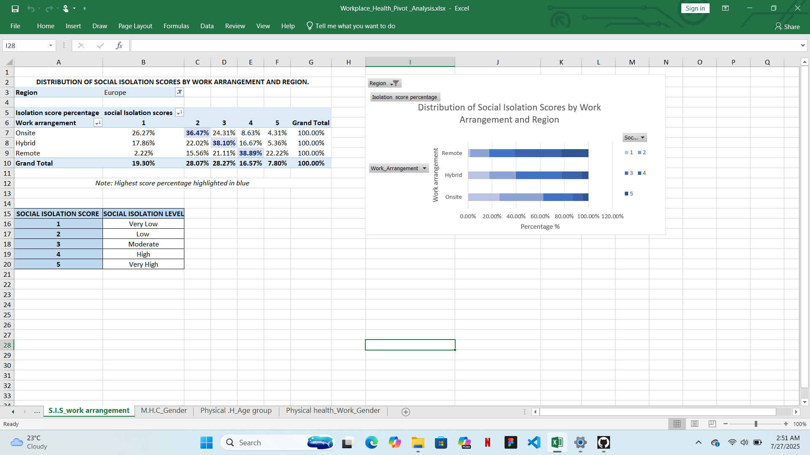
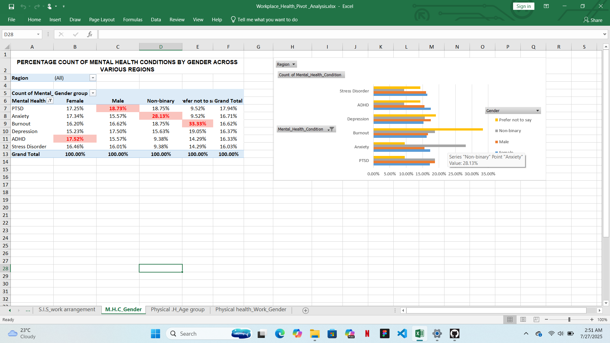
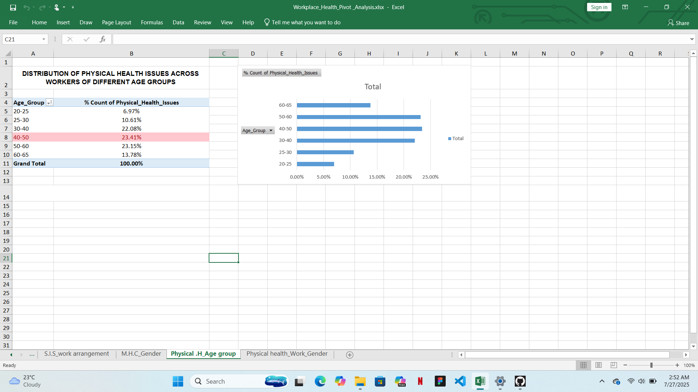
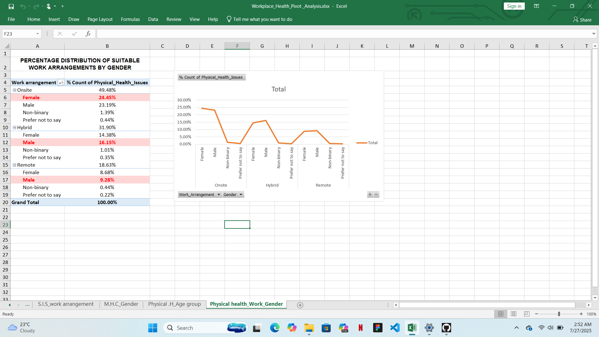

# Mental Health & Workplace Pivot Analysis

This project is a data exploration and visualisation of workplace-related mental and physical health indicators using Excel pivot tables.The data set includes survey responses covering work arrangements , gender,age group, mental health conditions, social isolation scores and physical health issues.

## What This Project Includes:

### 1. **Social Isolation by Work Arrangement**
-  Remote workers had **higher social isolation scores** than hybrid or onsite workers.
-  Includes a **legend** and **stacked bar chart** to visually support the analysis.
  
### 2. **Mental Health Conditions by Gender & Regions**
-  ADHD was more common in females, PTSD in males, Anxiety in non-binary respondents.
-  Visualized using a **clustered bar chart (percentage)**
-  It includes regional filters per gender
  
### 3. **Physical Health Distribution by Ages**
-  Workers aged **40-50** reported the **highest** percentage of physical health issues.
-  Conditional formatting highlighted the top age group.
  
### 4. **Physical Health by Gender and Work Arrangement**
-  Gender breakdown under onsite, hybrid, and remote categories showing how physical health issues vary by both factors.
-  Highest values highlighted for easier visual interpretation.
  
## Files Included:
-  'Workplace_Health_Pivot_Analysis.xlsx' - The full Excel workbook with all pivot tables and charts

## Tools Used:
-  Microsoft Excel (Pivot Tables, Charts, Conditional formatting)
  
## Data source:
-  The dataset used in this project *Mental Health & Workplace Pivot Analysis* was sourced from [Kaggle](https://www.kaggle.com/datasets/kshitijsaini121/remote-work-of-health-impact-survey-june-2025)

## What I Learned:
- How to build layered pivot tables with multiple filters
- How to extract meaningful trends from raw data
- How to use Excel charts for clear story telling 

## Note from Me:
> Hello! This project is part of my learning journey into data analysis. I'm a beginner exploring Excel, This is my first practical project on pivot tables in excel, I'm sharing my progress here as i build my skills and improve over time. I appreciate constructive feedback and suggestions for improvement as i grow!
